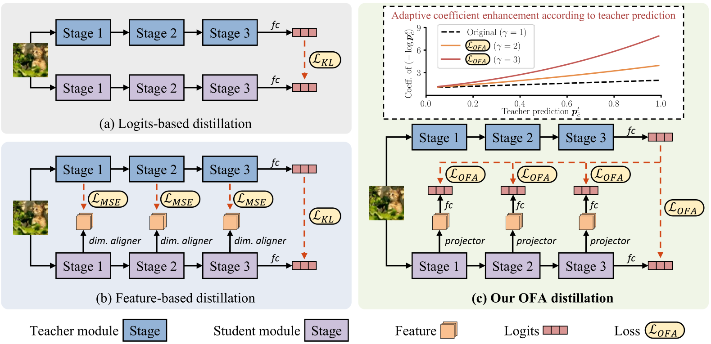

# One-for-All: Bridge the Gap Between Heterogeneous Architectures in Knowledge Distillation

Official PyTorch implementation of **OFA-KD**, from the following paper: \
One-for-All: Bridge the Gap Between Heterogeneous Architectures in Knowledge Distillation \
Zhiwei Hao, Jianyuan Guo, Kai Han, Yehui Tang, Han Hu, Yunhe Wang, Chang Xu

This paper studies using **heterogeneous** teacher and student models for knowledge distillation (KD) and proposes a one-for-all KD framework (OFA-KD). In this framework, intermediate features are projected into an aligned latent space to discard architecture-specific information, and an adaptive target enhancement scheme is proposed to prevent the student from being disturbed by irrelevant information.



If you find this project useful in your research, please cite:

```
@inproceedings{hao2023ofa,
  author    = {Zhiwei Hao and Jianyuan Guo and Kai Han and Yehui Tang and Han Hu and Yunhe Wang and Chang Xu},
  title     = {One-for-All: Bridge the Gap Between Heterogeneous Architectures in Knowledge Distillation},
  booktitle = {Advances in Neural Information Processing Systems},
  year      = {2023}
}
```

## Usage
First, clone the repository locally:

```
git clone https://github.com/Hao840/OFAKD.git
```

Then, install PyTorch and [timm 0.6.5](https://github.com/huggingface/pytorch-image-models/tree/v0.6.5)

```
conda install -c pytorch pytorch torchvision
pip install timm==0.6.5
```

Our results are produced with `torch==1.10.2+cu113 torchvision==0.11.3+cu113 timm==0.6.5`. Other versions might also work.

### Data preparation

Download and extract ImageNet train and val images from http://image-net.org/. The directory structure is:

```
│path/to/imagenet/
├──train/
│  ├── n01440764
│  │   ├── n01440764_10026.JPEG
│  │   ├── n01440764_10027.JPEG
│  │   ├── ......
│  ├── ......
├──val/
│  ├── n01440764
│  │   ├── ILSVRC2012_val_00000293.JPEG
│  │   ├── ILSVRC2012_val_00002138.JPEG
│  │   ├── ......
│  ├── ......
```

### Training

To train a resnet18 student using [DeiT-T teacher](https://dl.fbaipublicfiles.com/deit/deit_tiny_patch16_224-a1311bcf.pth) on ImageNet on a single node with 8 GPUs, run:

```
python -m torch.distributed.launch --nproc_per_node=8 train.py /path/to/imagenet --config configs/imagenet/cnn.yaml --model resnet18 --teacher deit_tiny_patch16_224 --teacher-pretrained /path/to/teacher_checkpoint --distiller ofa --ofa-eps 1.5
```

Other results can be reproduced following similar commands by modifying:

`--config `: configuration of training strategy. 

`--model`: student model architecture.

`--teacher`: teacher model architecture.

`--teacher-pretrained`: path to checkpoint of pretrained teacher model.

`--distiller`: which KD algorithm to use.

For information about other tunable parameters, please refer to `train.py`.

### Custom usage

**KD algorithm**: create new KD algorithm following examples in the `./distillers` folder.

**Model architecture**: create new model architecture following examples in the `./custom_model` folder. If intermediate features of the new model are required for KD, rewrite its `forward()` method following examples in the `./custom_forward` folder.

## Acknowledgement

This repository is built using the [timm](https://github.com/rwightman/pytorch-image-models) and the [mdistiller](https://github.com/megvii-research/mdistiller) library.


